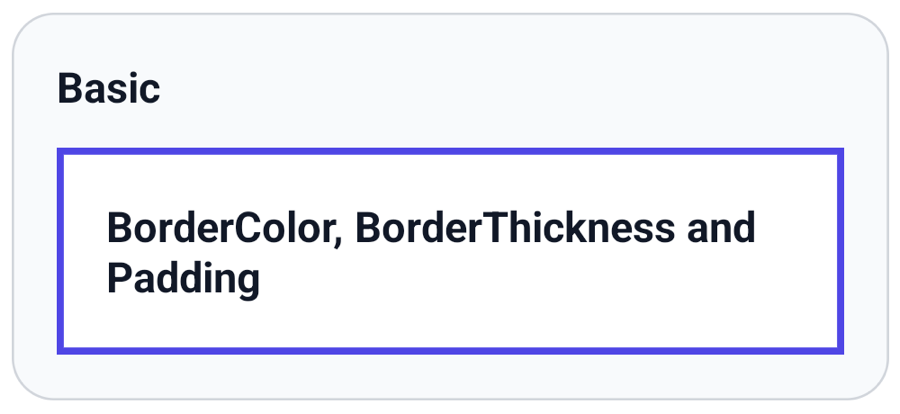
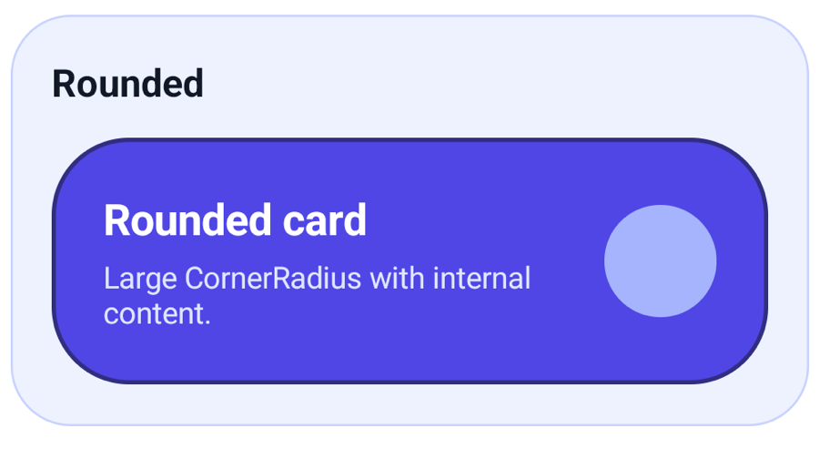
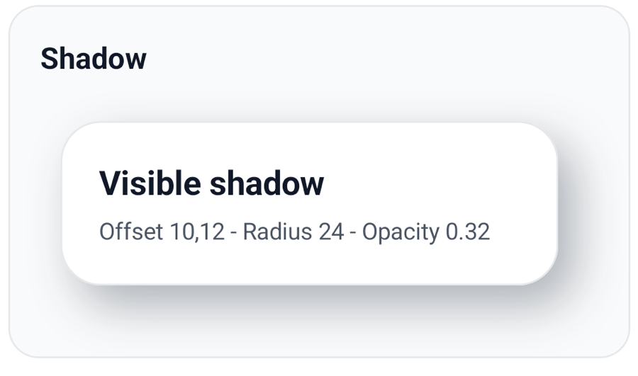
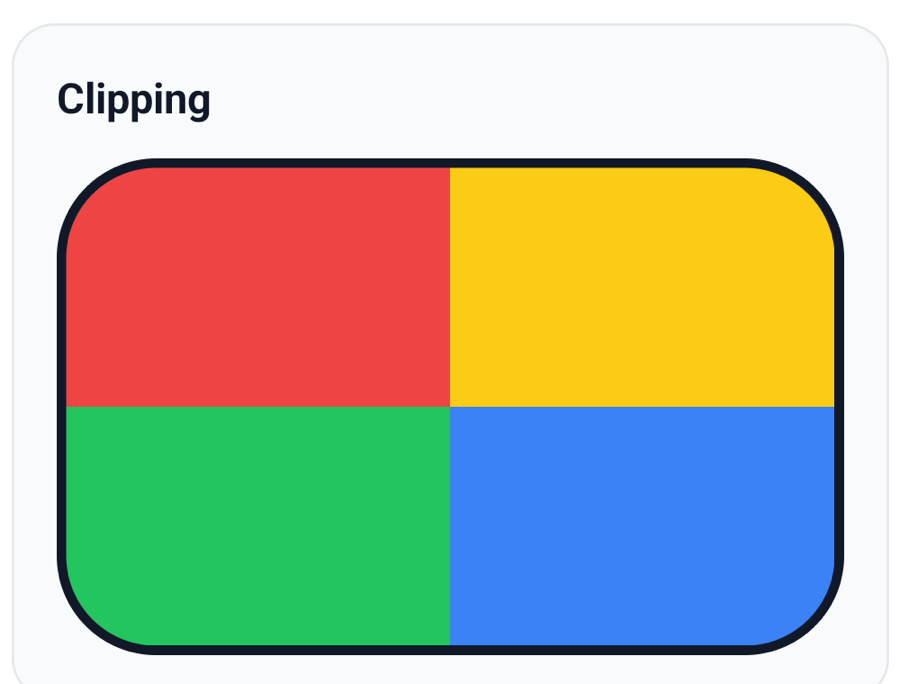
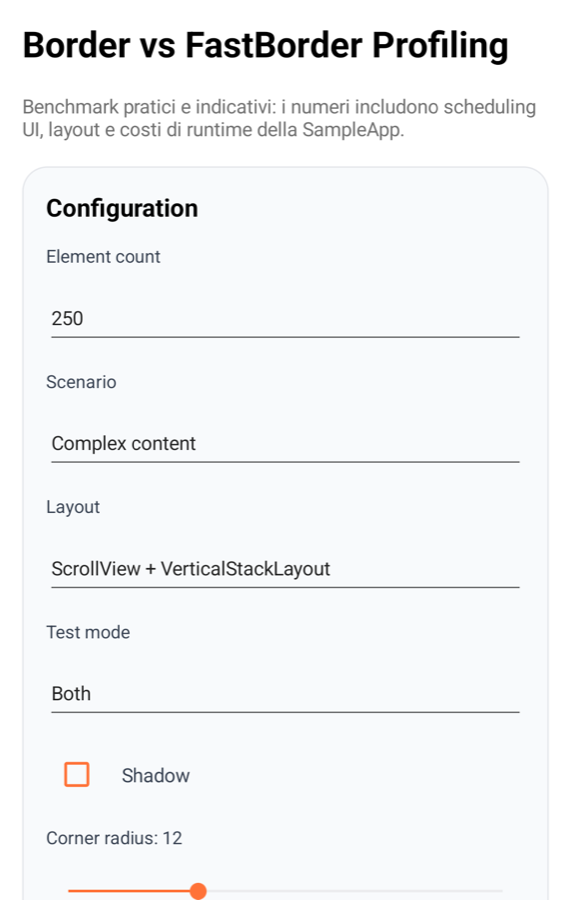

# FastBorder for .NET MAUI

A lightweight, native-rendered alternative to MAUI `Border`.

`FastBorder` is designed for Android and iOS scenarios where a simple single-content border needs lower layout/rendering overhead than a standard MAUI `Border`.

In the included SampleApp profiling scenario, FastBorder showed up to ~44.5% faster after-layout time in the empty-border comparison. Treat these results as indicative: actual performance depends on the scenario, device, operating system, and build configuration.

## Install

```bash
dotnet add package SevexLabs.Ui.Maui.Controls.FastBorder --version 1.0.0
```

## Register

Register the handler in `MauiProgram.cs`:

```csharp
using SevexLabs.Ui.Maui.Controls.FastBorder.Extensions;

builder.UseSevexLabsFastBorder();
```

## XAML

```xml
xmlns:fastBorder="clr-namespace:SevexLabs.Ui.Maui.Controls.FastBorder;assembly=SevexLabs.Ui.Maui.Controls.FastBorder"
```

`FastBorder` is a lightweight alternative to MAUI `Border`, but it does not use
the same border property names. Use `BorderColor`, `BorderThickness`, and
`CornerRadius`.

Do not use MAUI `Border` properties such as `Stroke`, `StrokeThickness`, or
`StrokeShape` with `FastBorder`.

```xml
<fastBorder:FastBorder
    BorderColor="#4F46E5"
    BorderThickness="1"
    CornerRadius="12"
    Padding="16">
    <Label Text="Native-rendered FastBorder" />
</fastBorder:FastBorder>
```

## Gallery

### Basic



Simple border with `BorderColor`, `BorderThickness`, `Padding`, and text content.

### Rounded



Rounded card-style border with a visible background and inner content.

### Shadow



FastBorder with visible shadow offset, radius, and opacity.

### Clipping



Colored content clipped by rounded corners.

### Profiling



SampleApp profiling view for practical, scenario-dependent measurements.
